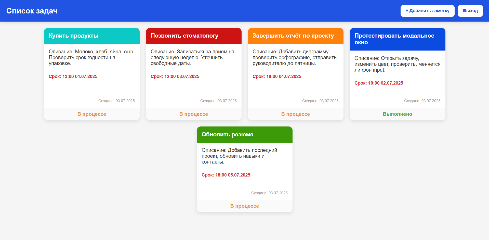
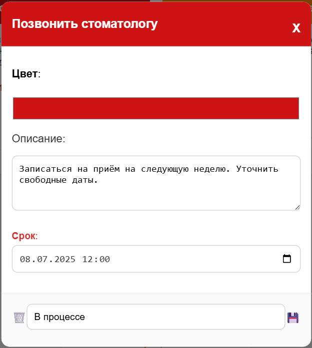

# 📝 ToDo API — Django + DRF


### 📛 ToDo API

Учебный проект для управления задачами (заметками), реализованный на Django с использованием Django REST Framework.

---


### 📘 О проекте


**ToDo API** — это проект веб-приложения для управления задачами, созданный с использованием фреймворка **Django** и библиотеки **Django REST Framework**. Пользователи могут создавать, редактировать, просматривать и удалять свои задачи. Также реализована регистрация, авторизация и разграничение доступа по пользователю.

Проект включает как API-интерфейс для взаимодействия с данными, так и веб-страницу с отображением задач текущего пользователя.

---

### 💻 Интерфейс пользователя



---

### ✏️ Модальное окно создания/редактирования задачи



---

## 📁 Навигация по проекту

```
todo-project/
├── main/                       # Основное приложение Django
│   ├── migrations/             # Миграции базы данных
│   ├── templates/              # HTML-шаблоны
│   │   └── main/
│   │       └── mainpage.html   # Страница задач
│   ├── models.py               # Модель задач
│   ├── serializers.py          # DRF-сериализаторы
│   ├── permissions.py          # Кастомные ограничения
│   ├── views.py                # Классы View и ViewSet'ы
│   ├── urls.py                 # URL-маршруты
│   └── ...
├── todo_project/               # Конфигурация Django-проекта
│   ├── settings.py             # Настройки проекта
│   └── urls.py                 # Глобальные маршруты
├── manage.py                   # Утилита для запуска
├── requirements.txt            # Зависимости проекта
├── .gitignore                  # Игнорируемые файлы
└── README.md                   # Описание проекта (этот файл)
```

---

## ⚙️ Функции

- 📋 Просмотр списка задач (только для авторизованных пользователей)
- 📝 Создание, редактирование и удаление задач
- 🔐 Регистрация и вход пользователя
- 🔗 API-доступ к задачам и пользователю
- 🎨 Поддержка цвета и сроков задач
- ✅ Ограничение задач только текущим пользователем

---

## 🛠 Установка

**Склонируйте репозиторий**:

 ```bash
 git clone https://github.com/kuramagod/ToDoDRFProject.git
 cd ToDoDRFProject
 ```

**Создайте виртуальное окружение и активируйте его**:

```bash
python -m venv venv
source venv/bin/activate   # или .\venv\Scripts\activate на Windows
```

**Установите зависимости**:

```bash
pip install -r requirements.txt
```

**Выполните миграции и запустите сервер**:

```bash
python manage.py migrate
python manage.py runserver
```

**В браузере**:

Web-интерфейс: http://127.0.0.1:8000/

API-интерфейс: http://127.0.0.1:8000/api/v1/tasks/
